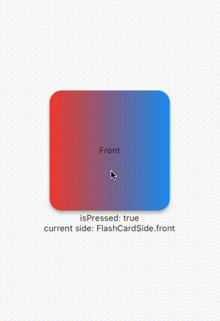

<!--
For information about how to write a good package README, see the guide for
[writing package pages](https://dart.dev/guides/libraries/writing-package-pages).
-->
[](https://github.com/oxelf/flutter_customizable_flashcards/actions/workflows/flutter_test.yml)

This is a package that uses the [flash_card](https://pub.dev/packages/flash_card) as foundation and adds additional functionality to it. 
I make this package, because the original author didnt made a new version in over 17 months so I assumed its no longer maintained. 


# Features

- change the appereance of the flashcard(color, gradient, size)
- ontap callback
- onFlip callback

# Getting started

check how to install [here](https://pub.dev/packages/customizable_flashcard/install)

# Usage

Basic example:

```dart
FlashCard(
    frontWidget: Text("Front"),
    backWidget: Text("Back"),
    )
```

Complex Example:

```dart
FlashCard(
    ontap: () {
    setState(() {
        isTapped = true;
    });
    },
    onFlip: (newSide) {
    setState(() {
        side = newSide;
    });
    },
    frontWidget: const Center(child: Text("Front")),
    backWidget: const Center(child: Text("Back")),
    frontGradient: const LinearGradient(
    colors: [Colors.red, Colors.blue],
    ),
    backGradient: const LinearGradient(
    colors: [Colors.red, Colors.blue],
    )),
``` 

This code produces this result: 




# Parameter

## Widgets
`frontWidget`: takes a widget as a parameter to show on the front of the card. (required)

`backWidget`: takes a widget as a parameter to show on the back of the card. (required)

## Size
`height`: takes a double as a parameter to set the height of the card. (default: 200)

`width`: takes a double as a parameter to set the width of the card. (default: 200)

## Styling
`frontColor`: takes a color as a parameter to show on the front of the card. (default: Colors.white) 

`backColor`: takes a color as a parameter to show on the back of the card. (default: Colors.white)

`frontGradient`: takes a gradient as a parameter to show on the front of the card. (default: null)

`backGradient`: takes a gradient as a parameter to show on the back of the card. (default: null)

`borderRadius`: takes a border radius as a parameter to set the border radius of the card. (default: 20)

`border`: takes a border as a parameter for the case you want to have a border. (default: null)

## callbacks
`ontap`: takes a function as a parameter to call when the card is tapped. (required)

`onFlip`: takes a function as a parameter to call when the card is flipped. Returns also the current side after the flip. (default: null)

# Additional information
I appreciate every PR, so feel free to contribute.
I will also look through all the issues on github and try to fix them as soon as possible.
